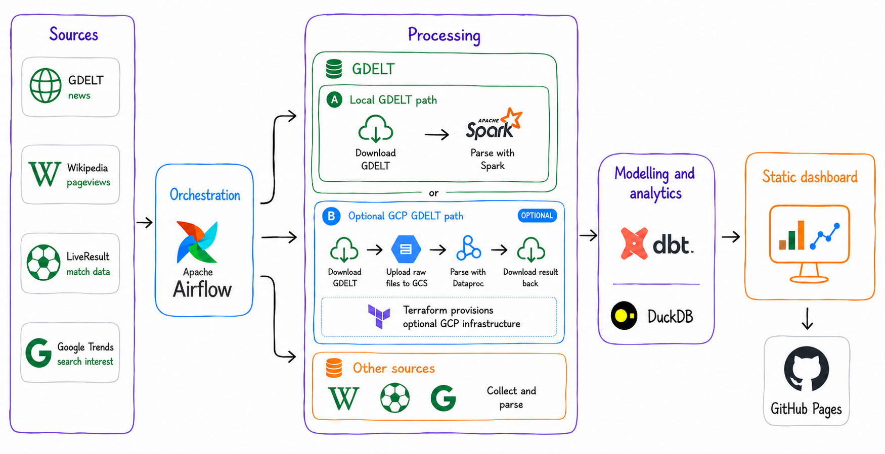

# Player Media Pressure Tracker

**Table of Contents**
* [Project Overview](#project-overview)
* [Dashboard and Articles](#dashboard-and-articles)
* [Data Sources](#data-sources)
* [Technologies](#technologies)
* [Project Structure](#project-structure)
* [Setup](#setup)
* [Running The Project](#running-the-project)
* [Running Scripts](#running-scripts)


## Project Overview

Player Media Pressure Tracker is an end-to-end Data Engineering project that measures media coverage and public attention using Kylian Mbappé as a case study. It combines GDELT news coverage, article tone and salience, Wikipedia pageviews, Google Trends interest and football match performance into a static dashboard. The project is designed to measure attention and context, not causality.

The pipeline is designed to be reproducible locally, with optional Google Cloud Storage and Dataproc support for larger GDELT backfills.



## Dashboard and Articles

- [Static dashboard](https://ar4ben.github.io/player-media-pressure-tracker/) is the published output of the pipeline described throughout this README.
- [The Mbappé Paradox: What the Data Says About Performance and Media Pressure](https://medium.com/@arthur.rodzkin/the-mbapp%C3%A9-paradox-what-the-data-says-about-performance-and-media-pressure-f28149b6f9eb) examines the main patterns, turning points and events visible in the data.
- [The Player Media Pressure Tracker: Anatomy of a Data Pipeline](https://medium.com/@arthur.rodzkin/fef1ccf46f24) provides a technical walkthrough of the pipeline architecture, source-specific workflows, data challenges and engineering trade-offs.

## Data sources 

- [GDELT Project](https://www.gdeltproject.org/)
- [Wikipedia Pageviews API](https://doc.wikimedia.org/generated-data-platform/aqs/analytics-api/)
- [Google Trends](https://trends.google.com/trends/)
- [LiveResult](https://www.live-result.com/)

## Technologies

- [Apache Airflow](https://airflow.apache.org/) for workflow orchestration
- [Docker](https://www.docker.com/) for running local services
- [Apache Spark](https://spark.apache.org/) for extracting compact GDELT candidate data from raw files
- [Google Cloud Dataproc](https://cloud.google.com/dataproc) for running Spark extraction on GCP
- [Google Cloud Storage](https://cloud.google.com/storage) for cloud data lake storage
- [dbt](https://www.getdbt.com/) for data transformation and modeling
- [DuckDB](https://duckdb.org/) for local analytical storage and dbt execution
- [Terraform](https://www.terraform.io/) for provisioning GCP resources
- [Chart.js](https://www.chartjs.org/) for dashboard charts
- [Tailwind CSS](https://tailwindcss.com/) for dashboard styling

## Project Structure

```text
.
├── airflow/
│   └── dags/                    # Airflow DAGs for GDELT backfills and full data refreshes
├── data/                        # Generated local runtime data, logs and warehouse
├── dbt/                         # dbt project for transformation and analytical modeling
├── docs/                        # Static dashboard published with GitHub Pages
├── src/
│   └── pipelines/               # Reusable pipeline logic and source entrypoints used by Airflow and scripts
├── scripts/                     # CLI wrappers around pipeline logic and small analysis utilities
├── terraform/                   # GCP infrastructure setup
├── tests/                       # Focused Python tests for core pipeline logic
├── Dockerfile                   # Project image used by Airflow services
├── docker-compose.yaml          # Local Airflow stack

```

## Setup
### Requirements

The default setup runs through Docker Compose. You do not need to install Python dependencies on the host machine to run the Airflow workflows.

Required for the default local setup:
- Docker
- Docker Compose

Required only for GCP-backed GDELT backfills (optional):
- Google Cloud CLI
- Terraform

Required only if you want to run Python scripts directly on the host machine (optional):
- uv
- Java 17 or another Spark-compatible Java runtime for local Spark extraction

The Docker image already includes the project dependencies, Google Cloud CLI and Java runtime used by Airflow tasks.

### Local Setup

Create the local environment file and runtime folders:
```bash
make setup
```
Then open `.env` and adjust values if needed. The default configuration is local-first, does not require GCP credentials and is enough to run the project locally.

Start the local Airflow stack: 
```bash
make up
```
Airflow will be available at:
```text
http://localhost:8080
```
Default credentials:
```text
airflow / airflow
```
To stop the stack:
```bash
make down
```

To run the stack in background mode, use:

```bash
docker compose up -d
```
If you change .env after containers are already running, recreate the containers so Docker Compose reloads the environment:

```bash
docker compose up -d --force-recreate
```

### Optional Local Python Setup

The Docker setup is enough for normal usage. If you want to run scripts, tests or notebooks directly on your host machine, install the Python environment with uv:
```bash
uv sync --dev
```
Then run commands through uv run, for example:
```bash
uv run python scripts/export_dashboard_data.py
```
For local Spark extraction outside Docker, make sure Java is installed and available on your `PATH`

### Optional GCP Setup

GCP is only needed for larger GDELT backfills that use Google Cloud Storage and Dataproc Serverless.

The Terraform setup creates the required GCS buckets, service account and IAM bindings for cloud-backed extraction. See the full setup guide in [`terraform/README.md`](terraform/README.md).


## Running The Project

The main project workflows are available in Airflow at [http://localhost:8080](http://localhost:8080) using the default credentials `airflow/airflow`.

Use the Airflow UI for normal runs. The project includes three main DAGs:

- `media_pressure_refresh` for regular end-to-end refreshes
- `gdelt_multi_year_backfill` for large historical GDELT backfills
- `gdelt_backfill` for a single GDELT backfill interval, usually triggered by the other DAGs

### Daily or Manual Refresh

Use `media_pressure_refresh` as the main operational DAG. It can run the full end-to-end refresh, but it can also run individual source, processing, dbt or dashboard export steps from the Airflow UI.

In Airflow, open `media_pressure_refresh`, click **Trigger DAG w/ config** and adjust the parameters if needed.

Main parameters:

| Parameter | Default | Description |
| - | - | - |
| `start_date` | required | First date included in the refresh. |
| `end_date` | required | Last date included in the refresh. |
| `run_wikipedia` | `true` | Refresh Wikipedia pageview data. |
| `run_football_matches` | `true` | Refresh football match data. |
| `run_google_trends` | `true` | Refresh Google Trends data. |
| `run_gdelt_backfill` | `true` | Run the GDELT backfill DAG for the selected date range. |
| `gdelt_mode` | `local` | Run GDELT extraction locally or through GCP Dataproc. Use `local` for the default Docker setup. |
| `gdelt_streams` | `regular, translation` | GDELT streams to include. Use both for the full dashboard dataset, or select one stream for targeted reruns. |
| `run_gdelt_cleanup` | `true` | Remove temporary GDELT files after extraction. The cleanup target is selected automatically from `gdelt_mode`: local files in `local` mode, GCS temporary files in `gcp` mode. |
| `run_gdelt_hydration` | `false` | Download existing GDELT bronze parquet from GCS into the local lake before processing. Useful after a GCP backfill. |
| `run_gdelt_processing` | `true` | Process GDELT bronze data into silver data. |
| `run_dbt` | `true` | Rebuild dbt models. |
| `run_dashboard_export` | `true` | Export dashboard JSON files into `docs/`. |

Recommended local run: keep default values

Recommended GCP-backed run:
- set `gdelt_mode = gcp`
- enable `run_gdelt_hydration = true` 

### Historical GDELT Backfill
There are two GDELT backfill DAGs:

- Use `gdelt_backfill` for a one-time run over a selected date range.
- Use `gdelt_multi_year_backfill` for large historical backfills that should be split into smaller intervals.

`gdelt_backfill` runs one GDELT interval directly. It is useful for small date ranges, targeted reruns and manual checks.

`gdelt_multi_year_backfill` is an orchestrator DAG. It splits a long date range into smaller child runs and triggers `gdelt_backfill` for each interval. The interval size is controlled by `interval_days`.

Examples:

- `interval_days = 90` keeps the default setup close to three-month intervals.
- `interval_days = 7` is useful when local disk space is limited.
- `interval_days = 1` is useful for testing the orchestration on a tiny range.

Keep `run_cleanup = true` when running large backfills locally. Otherwise temporary raw GDELT files will accumulate on disk.

### View The Dashboard
After the pipeline exports dashboard JSON files, serve the static dashboard locally:
```bash
uv run python -m http.server 8000 --directory docs
```

Then open:
```bash
http://localhost:8000
```
The repository already includes exported dashboard JSON files. Rerun the pipeline when you want to refresh or regenerate those files.

## Running Scripts
Most scripts are thin wrappers around `src/pipelines/`. For regular project usage, prefer Airflow DAGs. Scripts expose the same building blocks for debugging and manual runs.

Run a script inside the Airflow Docker image:

```bash
docker compose run --rm airflow-cli python scripts/export_dashboard_data.py
```

Run a script directly on the host machine:
```bash
uv run python scripts/export_dashboard_data.py
```

Use Docker when you want to run a command in the same runtime as Airflow tasks, especially for GDELT Spark extraction.

### Available Scripts
Scripts marked as "Runs with defaults" can be executed without arguments. Scripts that require a date range do not start work without arguments. They stop at argument parsing and print the expected CLI options.

| Script | Description | Run mode
| - | - | - |
| `scripts/football_matches_stat.py` | Prints quick statistics for collected football match data. | Requires `--start-date` and `--end-date` |
| `scripts/google_trends_stat.py` | Prints quick statistics for collected Google Trends data. | Requires `--start-date` and `--end-date` |
| `scripts/wikipedia_stat.py` | Prints quick statistics for collected Wikipedia pageview data. | Requires `--start-date` and `--end-date` |
| `scripts/gdelt/ingest_gdelt_files.py` | Runs the GDELT ingestion stage for a selected date range. | Requires `--start-date` and `--end-date` |
| `scripts/gdelt/extract_candidate_rows.py` | Runs local Spark extraction from raw GDELT files into bronze parquet. | Requires `--start-date` and `--end-date` |
| `scripts/gdelt/submit_dataproc_extraction.py` | Submits the GDELT Spark extraction stage to Dataproc Serverless. | Requires `--start-date` and `--end-date` |
| `scripts/gdelt/hydrate_bronze_from_gcs.py` | Downloads GDELT bronze parquet from GCS into the local lake. | Runs with defaults |
| `scripts/gdelt/process_candidate_rows.py` | Processes GDELT bronze data into silver data with deduplication and salience scoring. | Runs with defaults |
| `scripts/gdelt/clean_gdelt_files.py` | Removes temporary GDELT files locally or in GCS. | Requires `--start-date` and `--end-date` |
| `scripts/gdelt/gdelt_backfill_audit.ipynb` |  Interactive Python Notebook for inspecting GDELT backfill statistics, including downloaded file counts, file sizes and missing or failed files. | |
| `scripts/export_dashboard_data.py` | Exports dbt model outputs into dashboard JSON files in `docs/`. | Runs with defaults |

### Running Tests
```bash
docker compose run --rm airflow-cli python -m pytest
```
Run tests directly on the host machine:
```bash
uv run pytest
```
